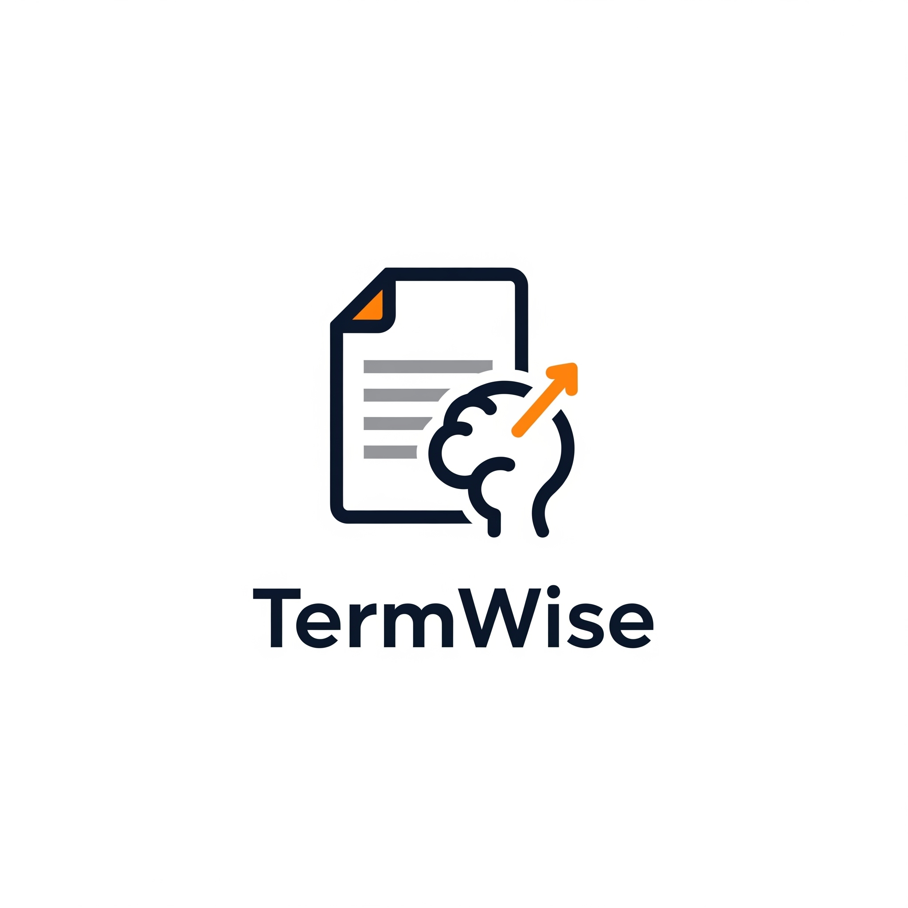
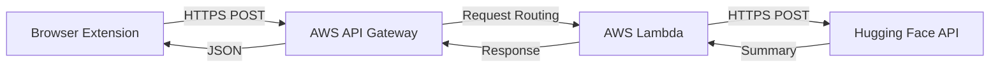

<div align="center">
  
</div>

# TermWise Backend

This repository contains the backend API for the TermWise browser extension. It's a serverless API built with FastAPI, designed to receive legal documents, analyze them using a powerful language model, and return a structured, easy-to-understand summary.

## Architecture

The backend is designed as a serverless application deployed on AWS, ensuring scalability, cost-efficiency, and low operational overhead. For local development and testing, it connects to the Hugging Face Inference API.



## Getting Started

Follow these steps to set up and run the project locally for development and testing.

### Prerequisites

- Python 3.9+
- An account on [Hugging Face](https://huggingface.co/) to get an API token.
- A tool for testing APIs, such as [Postman](https://www.postman.com/) or `curl`.

### Installation & Setup

1.  **Clone the repository:**
    ```bash
    git clone <YOUR_REPOSITORY_URL>
    cd TermWiseBackend
    ```

2.  **Create and activate a Python virtual environment:**
    ```bash
    # For Windows
    python -m venv venv
    .\venv\Scripts\Activate.ps1

    # For macOS/Linux
    python3 -m venv venv
    source venv/bin/activate
    ```

3.  **Install dependencies:**
    ```bash
    pip install -r requirements.txt
    ```

4.  **Configure Environment Variables:**
    Create a file named `.env` in the root directory of the project. This file will hold your secret API token.

    Open the `.env` file and add your Hugging Face API token:
    ```env
    HUGGINGFACE_API_TOKEN=hf_YourHuggingFaceTokenHere
    ```
    **Important:** The `.env` file is included in `.gitignore` and should never be committed to source control.

### Running the Application Locally

With the setup complete, run the local development server using `uvicorn`:

```bash
uvicorn app.main:app --reload
```

The server will start and listen for requests on `http://127.0.0.1:8000`. The `--reload` flag will automatically restart the server whenever you make changes to the code.

### Testing the API

You can test the running API using `curl` or Postman.

**Using `curl`:**

Open a new terminal and run the following command:

```bash
curl -X POST "http://127.0.0.1:8000/api/summarize" \
-H "Content-Type: application/json" \
-d '{"text": "Your long document text goes here..."}'
```

**Using Postman:**

1.  Create a new **POST** request.
2.  Set the URL to `http://127.0.0.1:8000/api/summarize`.
3.  Go to the **Body** tab, select **raw**, and choose **JSON** from the dropdown.
4.  Paste the following into the body:
    ```json
    {
        "text": "Your long document text goes here..."
    }
    ```
5.  Click **Send**.

You will receive a structured JSON response containing the document analysis.