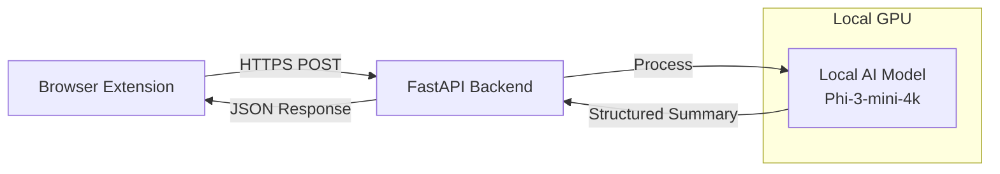

<div align="center">
  
</div>

# TermWise Backend

This repository contains the backend API for the TermWise browser extension. It's a serverless API built with FastAPI, designed to receive legal documents, analyze them using a local AI model, and return a structured, easy-to-understand summary.

## Architecture

The backend is designed as a serverless application that can be deployed on AWS, ensuring scalability and cost-efficiency. For local development and testing, it runs a quantized language model directly on your GPU for fast, private document analysis.



## Key Features

- **Local AI Processing**: Uses Microsoft's Phi-3-mini-4k model for fast, private document analysis
- **GPU Acceleration**: Optimized to run on NVIDIA GPUs with 4-bit quantization
- **Structured Output**: Returns well-formatted JSON with document type, summary, key terms, and section breakdowns
- **Fast API**: RESTful endpoints for document summarization and classification

## Getting Started

Follow these steps to set up and run the project locally for development and testing.

### Prerequisites

- Python 3.9+ (Note: Python 3.13 may have compatibility issues with some dependencies)
- NVIDIA GPU with at least 8GB VRAM (recommended) or CPU fallback
- CUDA-compatible GPU drivers
- Git for cloning the repository

### Installation & Setup

1.  **Clone the repository:**
    ```bash
    git clone <YOUR_REPOSITORY_URL>
    cd TermWiseBackend
    ```

2.  **Create and activate a Python virtual environment:**
    ```bash
    # For Windows
    python -m venv venv
    .\venv\Scripts\Activate.ps1

    # For macOS/Linux
    python3 -m venv venv
    source venv/bin/activate
    ```

3.  **Install dependencies:**
    ```bash
    pip install -r requirements.txt
    ```
    
    **Note**: The first time you run the application, it will download the AI model (~4GB). This is a one-time download that will be cached locally.

4.  **GPU Setup (Optional but Recommended):**
    If you have an NVIDIA GPU, the application will automatically use it for faster processing. The model uses 4-bit quantization to minimize VRAM usage (~2-3GB).

### Running the Application Locally

Run the local development server using `uvicorn`:

```bash
python -m uvicorn app.main:app --reload
```

The server will start and listen for requests on `http://127.0.0.1:8000`. The `--reload` flag will automatically restart the server whenever you make changes to the code.

**First Run**: The initial request will trigger the model download and loading, which may take a few minutes. Subsequent requests will be much faster.

### Testing the API

You can test the running API using `curl` or Postman.

**Using `curl`:**

```bash
curl -X POST "http://127.0.0.1:8000/api/summarize/" \
-H "Content-Type: application/json" \
-d '{"text": "Your legal document text goes here..."}'
```

**Note the trailing slash in the URL!**

**Using Postman:**

1.  Create a new **POST** request.
2.  Set the URL to `http://127.0.0.1:8000/api/summarize/` (with trailing slash).
3.  Go to the **Body** tab, select **raw**, and choose **JSON** from the dropdown.
4.  Paste the following into the body:
    ```json
    {
        "text": "Your legal document text goes here..."
    }
    ```
5.  Click **Send**.

### API Response Format

The API returns a structured JSON response:

```json
{
  "document_type": "Privacy Policy",
  "overall_summary": "This document outlines how user data is collected and used...",
  "key_terms": [
    {
      "term": "Personal Information",
      "definition": "Data that can identify you as an individual..."
    }
  ],
  "sectional_summaries": [
    {
      "section_title": "Data Collection",
      "detailed_summary": "The service collects user data through..."
    }
  ]
}
```

## Performance Optimization

The backend is optimized for performance:

- **4-bit Quantization**: Reduces model size from ~8GB to ~2GB with minimal quality loss
- **GPU Acceleration**: Automatically uses CUDA-capable GPUs when available
- **Lazy Loading**: Model loads only on first request to minimize startup time

## Deployment

For production deployment on AWS Lambda, the application includes:
- AWS Lambda handler via Mangum
- Serverless-friendly configuration
- Environment variable support

## Troubleshooting

- **Model Download Issues**: If you're behind a proxy, configure your proxy settings before running
- **GPU Memory Errors**: The 4-bit quantization should work on GPUs with 8GB+ VRAM
- **Slow First Request**: This is normal - the model needs to load into memory
- **JSON Parsing Errors**: The model occasionally produces imperfect JSON; the app includes fallback handling